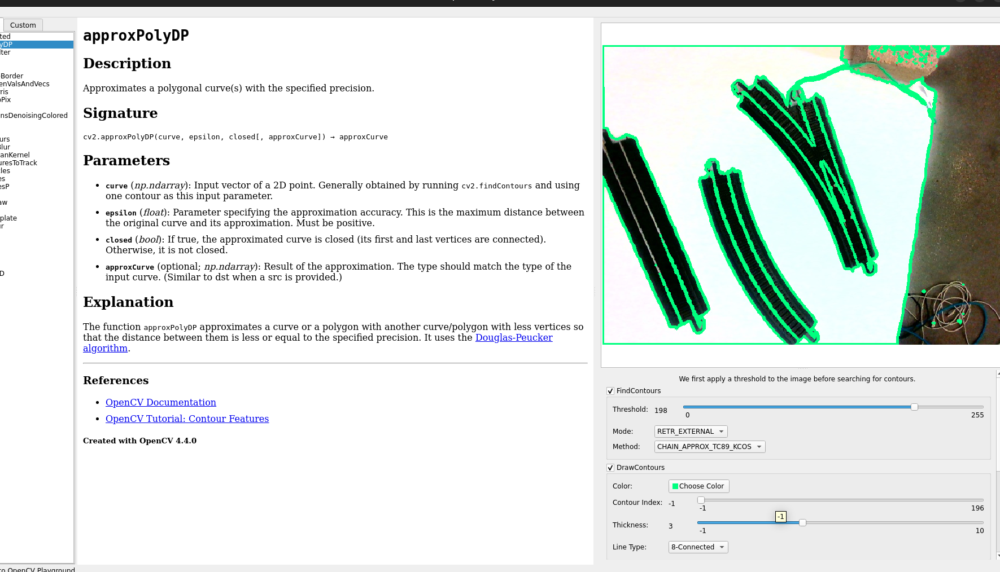

# OpenCV Playground 
The OpenCV Playground is a Qt6 application that brings together improved documentation alongside OpenCV functions with the ability to explore the effects of function parameters on an image in real time.

It also comes with a custom `Pipeline Launcher` that allows you to build and interact with your own sequence of image transformations along with custom build functions.

Full documentation can be found on [Read the Docs](https://opencv-pg.readthedocs.io/en/latest/).

Find the original readme at OriginalREADME.md

## Demo



## Setup Docker


Build docker
```
docker build -t opencv-pg:linux .
```

Give Docker Access to GUI
```
xhost +local:docker
```


## Usage Inside Docker
### Playground
To launch the OpenCV Playground with:
* The built-in image:

```shell
docker run -it --rm \
    -e DISPLAY=$DISPLAY \
    -e QTWEBENGINE_CHROMIUM_FLAGS="--no-sandbox --disable-gpu" \
    -v /tmp/.X11-unix:/tmp/.X11-unix \
    opencv-pg:linux opencvpg
```

* An image of your choice:

```shell
docker run -it --rm \
    -e DISPLAY=$DISPLAY \
    -e QTWEBENGINE_CHROMIUM_FLAGS="--no-sandbox --disable-gpu" \
    -v /tmp/.X11-unix:/tmp/.X11-unix \
    opencv-pg:linux opencvpg --image <path-to-image.png>
```

* Without the documentation window:
```shell
docker run -it --rm \
    -e DISPLAY=$DISPLAY \
    -e QTWEBENGINE_CHROMIUM_FLAGS="--no-sandbox --disable-gpu" \
    -v /tmp/.X11-unix:/tmp/.X11-unix \
    opencv-pg:linux opencvpg --image <path-to-image.png> --no-docs
```

### Custom Pipeline
The following is an example of building a custom Pipeline.

```python
from opencv_pg import Pipeline, Window, launch_pipeline
from opencv_pg import support_transforms as supt
from opencv_pg import transforms as tf

if __name__ == '__main__':
    my_image = '/path/to/image.png'

    # Creates two windows
    pipeline = Pipeline([
        Window([
            supt.LoadImage(my_image),
            supt.CvtColor(),
            tf.InRange(),
            supt.BitwiseAnd(),
        ]),
        Window([
            tf.Canny(),
        ]),
    ])

    launch_pipeline(pipeline)
```

### Running Tests
```shell
cd tests
pytest
```

### Generating Docs
* Go into the top level `docs` directory
* run `sphinx-apidoc -f -o source/ ../src/opencv_pg`
* run `make html`

Output will be in the `docs/build/html/` directory.
